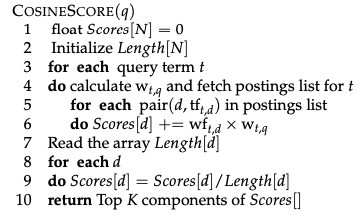
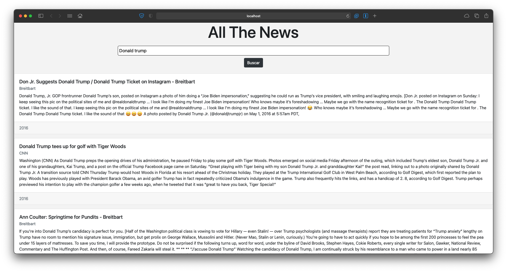

# Base de Datos 2 - Proyecto 2
### Integrantes
- Anthony Guimarey Saavedra
- Massimo Imparato Conetta
- Sebastian Knell Noriega

## Índice
  - [Introducción](#introducción)
  - [Implementación](#implementación)
    - [Construcción del índice invertido](#construcción-del-índice-invertido)
    - [Manejo en memoria secundaria](#manejo-en-memoria-secundaria)
    - [Ejecución óptima de consultas](#ejecución-óptima-de-consultas)
    - [Aplicación Web](#aplicación-web)
  - [Prueba de uso](#prueba-de-uso)
  - [Anexos](#anexos)


## Introducción
El objetivo de este proyecto fue implementar un índice invertido para tareas de búsqueda y recuperación en documentos de texto en base al modelo de recuperación por ranking y probar su desempeño mediante consultas en lenguaje natural. Para ello se construyó una aplicación frontend que realiza una búsqueda textual relacionado a ciertos temas de interés. Los resultados de búsqueda se obtienen aplicando la similitud de coseno sobre el índice invertido. Se uso un conjunto de datos de prueba obtenido de [Kaggle](https://www.kaggle.com/datasets). Este conjunto de datos está conformado por artículos de diferentes periódicos, que incluyen New York Times, CNN, Fox News, entre otros. Las publicaciones se encuentran principalmente entre los años 2016 y 2017. De acuerdo a lo aprendido, se espera obtener un alto grado de precisión a la consulta ingresada por el usuario, es decir, del conjunto de documentos recuperados, la mayoría son documentos relevantes para el usuario.

## Implementación
### Construcción del índice invertido
Para construir el índice invertido usamos la función `buildIndex()` que se muestra a continuación.
```python
def buildIndex():
    file = pd.read_csv(DATA_FILE, encoding='UTF-8')
    termIndex = {}
    docNorms = {}
    for id, row in file.iterrows():
        text = row['title'] + ' ' + row['content']
        words = parse(text)
        
        tf = getTermFrequenies(words)
        vector = np.array([item[1] for item in tf.items()])
        docNorms[id] = np.linalg.norm(vector)

        for token in words:
            if len(token) > 0 and token in termIndex.keys():
                if id in termIndex[token].keys():
                    termIndex[token][id] += 1
                else:
                    termIndex[token][id] = 1
            else:
                termIndex[token] = {id: 1}

    termIndex = dict(sorted(termIndex.items(), key=lambda elem: elem[0]))
    writeIndex(termIndex, TERM_INDEX_FILE)
    with open(DOC_NORMS_FILE, 'w+') as outFile:
        outFile.writelines(str(docNorms))
```

Debido a que nuestra colección de documentos esta en un archivo csv, empezamos leyendo este archivo. Para ello nos ayudamos de la función `read_csv` de pandas. Luego iteramos por cada fila, que en este caso representa un documento, y tokenizamos el texto concatenando el título del documento con su contenido. Para ello se uso la función `parse` que se puede ver en [tokenizer.py](./src/tokenizer.py). Esta se encarga del proceso de tokenización utilizando la librería `nltk` así como de filtración de stopwords y stemming. Luego almacenamos estos tokens o términos en el diccionario `termIndex`. Este sera un diccionario de 2 dimensiones en el cual se almacenará para cada término un diccionario que contiene el id y la frecuencia de este para cada documento en el que aparece. Sin embargo, al escribiro a un archivo lo tratamos como el id separado por un espacio a una lista de tuplas. Además, mantenemos el diccionario `docNorms` el cual ira guardando el factor de normalización de cada documento. Para esto último nos ayudamos de la librería numpy. Finalmente, escribimos ambos archivos a disco.


### Manejo en memoria secundaria
Nuestra implementación mantiene 2 archivos en disco los cuales se cargan al correr el servidor: el índice invertido y los factores de normalización de cada documento. Inicialmente se intentó utilizar el algoritmo BSB (Blocked sort-based) para la construcción del índice. Algo de esto se puede ver en la rama dev donde llegamos a construir el índice dividido en varios archivos. Sin embargo, tuvimos problemas en el proceso de merge. 


## Ejecución óptima de consultas
Para procesar las consultas en lenguaje natural se tuvo que parsear el texto ingresado por el usuario. La funcion `parse()` realiza esta tarea.

La función `parse(text)` recibe un string de texto, lo procesa, tokeniza, y devuelve una lista de los términos ya procesados.
```python
def parse(text):
    words = word_tokenize(text.lower().strip())
    i = 0
    while i < len(words):
        if words[i] in stoplist:
            words.pop(i)
        else:
            i += 1
    for i in range(len(words)):
        words[i] = stemmer.stem(words[i])
    return words
```

Ahora veamos lo que se encuentra en el archivo [queries.py](queries.py).

En primer lugar, tenemos una constante `N = 53929`, que es el número de artículos que tenemos en el archivo de datos [articles1.csv](data/articles1.csv).

Luego tenemos varias funciones de procesamiento de términos para hallar Term Frequencies, Inverse Document Frequencies, Amortiguación de Frequencies y Normalización. A un inicio haciamos uso de estas para procesar las queries ya que lo hacíamos en forma de vectores. 
``` python
def getIDF(terms):
    df = len(terms)
    return math.log10(N/df)

def getTF_IDF(tf, idf):
    tf_idf_vec = []
    for j in tf:
        i = j[1]
        tf_idf_vec.append((j[0], i * idf))
    return tf_idf_vec

def getLogFreq(tf):
    logFreq_vec = []
    for j in tf:
        i = j[1]
        if(i > 0):
            logFreq_vec.append((j[0], 1 + math.log10(i)))
        else:
            logFreq_vec.append((j[0], 0))
    return logFreq_vec

def getNorm(terms):
    norm = 0
    for tf in terms:
        norm += (tf**2)
    return math.sqrt(norm)

def normalizeTerms(terms, norm):
    normalized = []
    for tf in terms.items():
        normalized.append((tf[0], tf[1]/norm))
    return normalized
```

Sin embargo, nos dimos cuenta que requeriamos de procesar dichas queries y los documentos relevantes como diccionarios, así que decidimos implementar el algoritmo `processQuery(query, index, docNorms)`. El cual recibe la query a procesar, el índice invertido y el documento que contiene las normas de cada documento en la colección.

El algoritmo es basado en el que se mostró en la ppt de la clase, y en el libro:



``` python
def processQuery(query, termIndex, docNorms):
    parsed = parse(query)
    wtq = getTermFrequenies(parsed)

    scores = {}
    for term in parsed:
        plist = termIndex.get(term)
        idf = 0 if plist == None else getIDF(plist)
        wtq[term] = wtq[term] * idf

        if plist != None:
            for doc, tf in plist.items():                        
                if doc in scores.keys():
                    scores[doc] += tf * wtq[term]
                else:
                    scores[doc] = tf * wtq[term]

    for d in scores.keys():
        scores[d] = scores[d]/docNorms[d]

    scores = {key: val for key, val in sorted(
        scores.items(), key=lambda elem: elem[1], reverse=True)}

    return [int(item[0]) for item in list(scores.items())[:10]]
```

La función hace uso de `parse()` para procesar la query y utiliza `getTermFrequencies()` para obtener las frecuencias de cada término en la query.

### getTermFrequencies()
``` python
def getTermFrequenies(terms):
    tf = {}
    for term in terms:
        if term in tf.keys():
            tf[term] += 1
        else:
            tf[term] = 1
    return tf
```
Luego, inicializamos un diccionario donde guardaremos los `scores` y recorremos cada término de la query en la query ya parseada. Para cada uno de estos términos obtenemos su posting list. Si el término tiene frecuencia, calculamos el IDF, de modo contrario, le asignamos 0. A partir de esto, guardamos en el diccionario `wtq[term]` la frecuencia del término x su idf (W<sup>tq</sup>).

A continuación, si la posting list del término no está vacía, para cada par documento y tf: guardamos en el diccionario de `scores` la suma de los scores W<sup>td</sup> x W<sup>tq</sup>.

Dividimos cada score por la norma de su respectivo documento.

Finalmente, ordenamos el diccionario de `scores` en orden descendente y retornamos los 10 documentos con mayor puntaje (los más relevantes).

### Aplicación web
Para visualizar los resultados implementamos una pequeña aplicación web usando [Flask](https://flask.palletsprojects.com/en/2.0.x/#) para el servidor y [Angular](https://angular.io/) para el front. A continuación se muestra la interfaz.


## Prueba de uso
Se adjunta el siguiente video que muestra la funcionalidad de la aplicación.

## Anexos
- Descripción de los campos en los registros del conjunto de datos

Atributo | Definición
------------ | -------------
id | Identificador único
title | Título de la publicación
publication | Diario en el que fue publicado
author | Autor que redacto el artículo
date | Fecha de publicación
year | Año de publicación
month | Mes de publicación
url | URL del artículo (no disponible para todos)
content | Contenido del artículo
